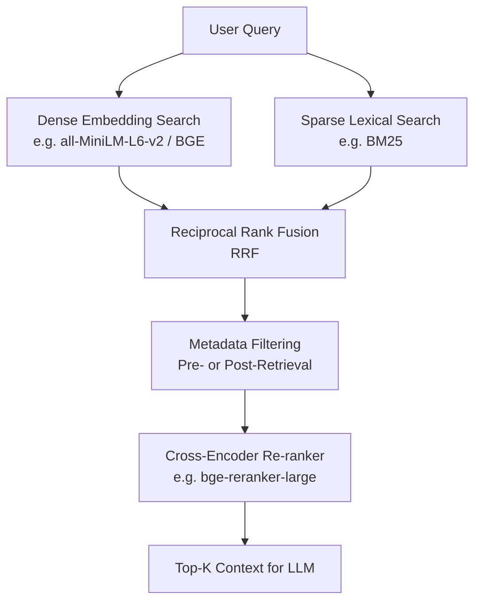

# Production Hybrid Search & RAG Implementation Plan

This document outlines the architecture, pipeline stages, and implementation strategies for building a production-grade Retrieval-Augmented Generation (RAG) system. It transitions our existing semantic search prototype into a robust hybrid retrieval system with advanced chunking, metadata filtering, and comprehensive evaluation.

---

## 1. Document Preprocessing & Cleaning
To ensure high-quality retrieval, raw documents must be cleaned and structured before chunking.
* **Text Normalization**: Strip irrelevant HTML/markdown formatting, normalize whitespaces, and resolve encoding inconsistencies.
* **spaCy Pipeline**:
  * **Tokenization**: Standardize sentence boundaries and token representations.
  * **Stopword & Noise Filtering**: Selectively remove generic stopwords and irrelevant characters (e.g., boilerplate headers/footers) while preserving key semantic indicators.

---

## 2. Advanced Chunking Strategies
Proper chunking balances retrieval precision (finding the right block of text) with synthesis context (providing the LLM with enough background).

### Option A: Recursive Character Splitting with Parent-Child Retrieval (Recommended)
This approach decouples the chunk used for similarity search from the chunk used as context for the LLM.
* **Parameters**:
  * **Child Chunks (for Search)**: 128 to 256 tokens (~100–180 words) to enable highly precise matching.
  * **Parent Chunks (for LLM Context)**: 512 to 1024 tokens (~350–700 words) with 10%–20% token overlap to preserve structural flow and context.
* **Mechanism**:
  1. Split text into small child chunks and link each to a parent chunk.
  2. Embed and index only the child chunks.
  3. When a child chunk matches the query, retrieve its associated parent chunk and feed the parent chunk to the LLM.

### Option B: Semantic Chunking (Advanced Alternative)
Instead of arbitrary character or token counts, semantic chunking groups sentences by topical cohesion.
* **Mechanism**:
  1. Segment the document into individual sentences.
  2. Generate embeddings for each sentence and calculate semantic similarity (cosine distance) between adjacent sentences.
  3. Establish a distance threshold. Split the text into a new chunk only when the semantic distance exceeds the threshold.
  4. **Benefit**: Eliminates paragraph cutting in the middle of a thought, grouping topically identical prose perfectly.

---

## 3. Retrieval Architecture (Hybrid Search & Re-ranking)
Production RAG systems require a combination of semantic and lexical search to cover both broad themes and specific keyword queries.

### Hybrid Retrieval
1. **Dense Retrieval (Semantic)**: Captures conceptual meaning. Uses vector embeddings generated by models like `all-MiniLM-L6-v2` or `bge-large-en-v1.5`.
2. **Sparse Retrieval (Lexical)**: Captures exact term matching (e.g., part numbers, names, error codes). Implemented using BM25.
3. **Reciprocal Rank Fusion (RRF)**: Merges dense and sparse retrieval ranks into a unified score.

### Metadata Filtering
* **Goal**: Prevent hallucinations and avoid retrieving irrelevant documents by applying structured filters (e.g., date range, department, doc type) before or during vector search.
* **Implementation**: Store metadata attributes along with embeddings. Apply boolean constraints during the database query step to restrict the search space.

### Re-ranking
* Pass the top retrieved documents (e.g., top 25) through a Cross-Encoder (re-ranker). This computes a deep, query-document interaction score to select the absolute best top-K chunks (e.g., top 5) for the LLM.

---

## 4. Evaluation Framework
To measure search and generation quality over time, we will implement continuous evaluation.

* **Framework**: [RAGAS](https://github.com/explodinggradients/ragas) (Retrieval Augmented Generation Assessment).
* **Key Metrics**:
  * **Faithfulness**: Measures if the generated answer is strictly grounded in the retrieved context (checking for hallucinations).
  * **Answer Relevance**: Measures if the generated answer directly addresses the user query.
  * **Context Recall**: Measures if the retrieval system found all relevant information needed to answer the question.
  * **Context Precision**: Measures the ratio of relevant to irrelevant chunks in the retrieved context.
* **Dataset Generation**: Use an LLM-as-a-judge (e.g., GPT-4o or Claude 3.5 Sonnet) to auto-generate a diverse QA test set from our documents to benchmark changes.

---

## 5. Storage & Production Scaling
* **Transition**: Evolve from the lightweight local JSON file store (`data/embeddings.json`) to a production-grade database:
  * **Vector Database**: Use **Qdrant**, **pgvector**, or **Milvus** to handle indexing, hybrid search, metadata filtering, and real-time CRUD operations.
  * **Document Store**: Use a relational or document database (e.g., PostgreSQL, MongoDB) to store raw parent text linked to vector IDs.