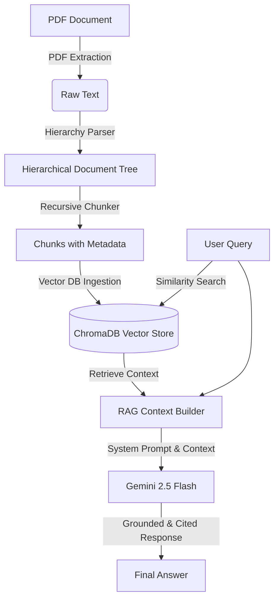

# Knowledge Base Search (RAG Pipeline)

A robust Retrieval-Augmented Generation (RAG) system built from scratch in Python to parse, index, search, and answer queries from a PDF-based knowledge base (e.g., company policies) using ChromaDB and the Google Gemini API.

---

## Architecture Overview

The system processes documents and answers queries through the following pipeline:



---

## Project Structure

*   [main.py](file:///Users/mano/workspace/agentic-ai-learnings/knowledge-base-search/main.py): Pipeline orchestrator that ties the parser, chunker, database service, and LLM service together in a CLI loop.
*   [parser_service.py](file:///Users/mano/workspace/agentic-ai-learnings/knowledge-base-search/parser_service.py): Custom regex- and stack-based hierarchical parser that groups content into `document`, `section`, and `sub_section` nodes.
*   [chunker_service.py](file:///Users/mano/workspace/agentic-ai-learnings/knowledge-base-search/chunker_service.py): Recursive chunking mechanism that generates semantic chunks with metadata (like title and hierarchy type).
*   [db_service.py](file:///Users/mano/workspace/agentic-ai-learnings/knowledge-base-search/db_service.py): ChromaDB client wrapper for storing, indexing, and querying semantic text chunks.
*   [llm_service.py](file:///Users/mano/workspace/agentic-ai-learnings/knowledge-base-search/llm_service.py): Google GenAI SDK interface configured with strict system guidelines for accurate, context-grounded, and cited responses.

---

## Features

1.  **Hierarchical Parsing**: Maintains document structure (sections like `1. Section` and subsections like `1.1 Subsection`) during ingestion rather than doing a naive text split.
2.  **Vector Search with ChromaDB**: Stores embeddings locally to perform fast, metadata-aware semantic search.
3.  **Strict Grounded QA**: Prevents hallucination by configuring Gemini with strict rules (e.g., outputting "I cannot answer this based on the provided information" if facts are missing).
4.  **Citations**: Returns grounded answers with source document section titles as citations.

---

## Setup & Installation

### Prerequisites

*   Python `>= 3.14` (as defined in `pyproject.toml`)
*   `uv` or standard `pip` for dependency management.

### Dependencies

*   `chromadb` (v1.5.9+)
*   `google-genai` (v2.11.0+)
*   `pypdf` (v6.14.2+)
*   `python-dotenv` (v1.2.2+)

### Step-by-Step Setup

1.  **Clone the workspace** and navigate to the project directory:
    ```bash
    cd knowledge-base-search
    ```

2.  **Install dependencies**:
    If using `uv` (recommended):
    ```bash
    uv sync
    ```
    If using `pip`:
    ```bash
    pip install -r pyproject.toml
    ```

3.  **Set up Environment Variables**:
    Create or edit the `.env` file in the root of `knowledge-base-search/` and add your Gemini API Key:
    ```env
    GEMINI_API_KEY=your_gemini_api_key_here
    ```

4.  **Prepare Assets**:
    Place the target PDF document inside the `assets/` directory (configured to [acme_corp_policies_rag_test.pdf](file:///Users/mano/workspace/agentic-ai-learnings/knowledge-base-search/assets/acme_corp_policies_rag_test.pdf)).

---

## Usage

Run the main orchestrator to start the ingestion pipeline and enter the interactive query session:

```bash
python main.py
```

### Flow description:
1.  **Ingestion**: Extracts PDF text, structures it into sections/subsections, chunks it, and upserts it into the local ChromaDB database (stored under `./knowledge_base`).
2.  **Query Loop**: You will be prompted with `Enter your query:`.
3.  **Retrieval & Generation**: The system retrieves the top 3 most similar document chunks, formats them as context, queries `gemini-2.5-flash`, and prints the response.
4.  **Exit**: Type `exit` to quit the query loop.


## Current Limitations

- Optimized for structured policy documents.
- Uses a custom hierarchy parser based on numbered headings.
- Does not yet support scanned PDFs or OCR.
- Does not perform reranking or metadata filtering.
- Uses semantic retrieval only (no hybrid keyword search).