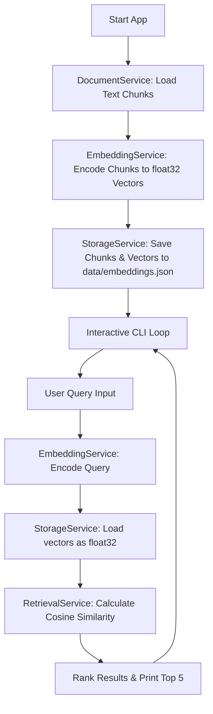

# Semantic Search Engine

A lightweight, local semantic search engine built in Python. This project utilizes the `sentence-transformers` library to index textual document chunks, generate dense vector embeddings, store them in a local JSON vector store, and perform semantic retrieval using Cosine Similarity.

---

## Features
- **Semantic Text Matching**: Goes beyond keyword matching by understanding context and relationships between words.
- **Local Embedding Generation**: Generates 384-dimensional dense vectors using the `all-MiniLM-L6-v2` model.
- **JSON Vector Store**: Lightweight serialization and storage of documents and vector embeddings.
- **Ranked Retrieval**: Automatically ranks the top 5 most relevant documents using cosine similarity.
- **Clean Architecture**: Built using decoupled services with **Dependency Injection** to prevent redundant memory allocation.

---

## Application Flow



1. **Initialization**: On application start, `SearchApp` constructs instances of `DocumentService`, `EmbeddingService`, and `StorageService`. These instances are injected into `RetrievalService`.
2. **Indexing**: 
   - Raw text is loaded into chunks.
   - Text chunks are encoded into numerical vector representations.
   - The document-vector pairs are serialized and saved to `data/embeddings.json`.
3. **Retrieval**: 
   - When a query is input, it is converted into a vector.
   - The indexed vectors are read from storage and cast to `float32`.
   - Cosine Similarity scores are computed between the query vector and all document vectors.
   - Results are sorted by score descending, and the top 5 results are returned.

---

## Setup & Installation

### Prerequisites
- Python 3.10 or higher.
- A virtual environment tool (`venv`).

### Installation Steps
1. Navigate to the root directory of the project:
   ```bash
   cd semantic-search-engine
   ```

2. Create and activate a Python virtual environment:
   ```bash
   # Create a virtual environment
   python -m venv venv

   # Activate the virtual environment (macOS/Linux)
   source venv/bin/activate

   # Activate the virtual environment (Windows Command Prompt)
   venv\Scripts\activate
   ```

3. Install the required dependencies:
   ```bash
   pip install -r requirements.txt
   ```

---

## Running the Project

Run the application as a Python module:
```bash
python -m app.main
```

### Example Interactive Session:
```text
Welcome to semantic search engine
Embeddings stored in vector store
Enter your query: How do you calculate distance?
Retrieved documents: [
  {'document': 'Systems use metrics like Cosine Similarity to measure the distance between two semantic vectors.', 'score': 0.4344612658023834}, 
  {'document': 'Embeddings map text into a continuous vector space where semantically similar texts are placed close together.', 'score': 0.09946592152118683}, 
  {'document': 'Semantic search solves keyword limitations by understanding the context and relationships between words.', 'score': 0.09827238321304321}, 
  ...
]
Enter your query: exit
```
To exit the interactive search loop, type `exit`.
